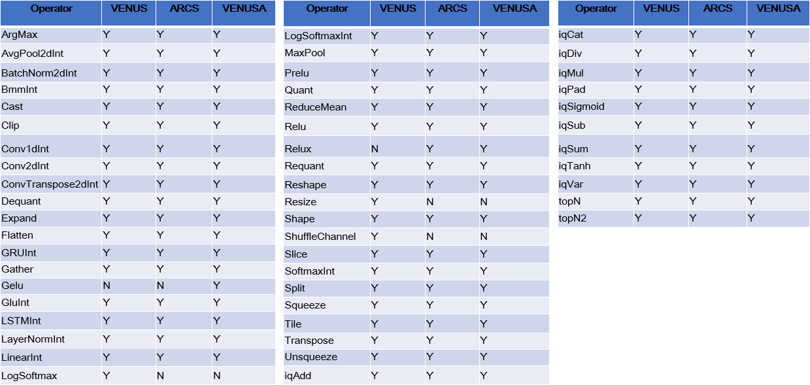

# 支持量化 OP 列表及限制说明

本文档汇总 Thinker 当前支持的量化 OP、命名规则、常用量化术语以及各 OP 的输入、输出、属性和类型约束。不同硬件平台的精度和参数限制可能不同，请优先参考精度速查表确认目标平台是否支持。

## 算子目录

## 计算精度与约束速查

NPU 是面向神经网络模型的专用加速器，算子能力会受到硬件能力、底层库能力以及工具链开发进度的共同影响。部分算子对输入精度、权重精度、输出精度、参数范围和 workspace 有额外限制；工具链会在离线分析阶段对这些限制进行检查。

- 详细表格：[`operator_precision_support.xlsx`](operator_precision_support.xlsx)
- 覆盖平台：`venus`、`arcs`、`venusa`
- 建议用法：新增模型或排查转换失败时，先在该表中按平台查询 OP 支持情况和参数约束。

## Operator 命名规则

命名格式：`(MajorName)[_Inputs_Outputs]`

### MajorName

`MajorName` 为 Operator 主名称，仅允许使用英文字母和数字，名称内部不允许包含符号。例如：`iqMul`。

### Inputs / Outputs

`Inputs` 和 `Outputs` 为可选字段，用于描述输入和输出的数据类型与位宽。输入格式为 `IXB`，输出格式为 `OXB`：

- `I` 表示输入，`O` 表示输出。
- `X` 表示数据类型。
- `B` 表示数据位宽。
- `XB` 组合采用 ARM NEON-like 类型定义。

| CType | X | B | 组合 |
| --- | --- | --- | --- |
| int8_t | s | 8 | s8 |
| uint8_t | u | 8 | u8 |
| int16_t | s | 16 | s16 |
| uint16_t | u | 16 | u16 |
| int32_t | s | 32 | s32 |
| uint32_t | u | 32 | u32 |
| int64_t | s | 64 | s64 |
| uint64_t | u | 64 | u64 |
| float16 | f | 16 | f16 |
| float | f | 32 | f32 |
| double | f | 64 | f64 |

## 术语说明

### 量化方式

部分 OP 属性中包含 `platform_quant`，用于标识平台相关的量化方法。

- `luna_quant`：Castor 全量化方式（int8 -> int8）。面向 Castor 硬件量化，浮点到定点的 round 采用 `(x + 0.5).floor()`。

$$(\lfloor x\_int * \frac{scale\_z}{scale\_x} + 0.5 \rfloor + \lfloor y\_int * \frac{scale\_z}{scale\_y} + 0.5 \rfloor).int().clamp(-128, 127)$$

### Scale 说明

- `scale_i`：Input 的 scale，`scale_x`、`scale_1`、`scale_2`、`scale_y` 同理；`bits` 可取 8、16 等。

$$\frac{2^{bits-1}-1}{running\_i}$$

- `scale_w`：Weight 的 scale，`scale_iw`、`scale_hw` 同理；`bits` 可取 8、16 等。

$$\frac{2^{bits-1}-1}{weight.abs().max()}$$

- `scale_o`：Output 的 scale；`bits` 可取 8、16 等。

$$\frac{2^{bits-1}-1}{running\_o}$$

### Mode 参数

- `mode`：所有模式下的 device 信息。

### ONNX 类型值

#### 类型说明

| Group | Types | Description |
| --- | --- | --- |
| Floating Point Types | FLOAT16, FLOAT32, FLOAT64 | Values adhering to the IEEE 754-2008 standard representation of floating-point data. |
| Signed Integer Types | INT8, INT16, INT32, INT64 | Signed integers are supported for 8-64 bit widths. |
| Unsigned Integer Types | UINT8, UINT16 | Unsigned integers of 8 or 16 bits are supported. |
| Complex Types | COMPLEX64, COMPLEX128 | A complex number with either 32- or 64-bit real and imaginary parts. |
| Other | STRING | Strings represent textual data. All strings are encoded using UTF-8. |
| Other | BOOL | Boolean values represent data with only two values, typically true and false. |

#### 类型和值

| 类型 | 值 |
| --- | --- |
| UNDEFINED | 0 |
| FLOAT32 | 1 |
| UINT8 | 2 |
| INT8 | 3 |
| UINT16 | 4 |
| INT16 | 5 |
| INT32 | 6 |
| INT64 | 7 |
| STR | 8 |
| BOOL | 9 |
| FLOAT16 | 10 |
| UINT32 | 12 |
| UINT64 | 13 |
| COMPLEX64 | 14 |
| COMPLEX128 | 15 |
| BFLOAT16 | 16 |

## 算子说明

### 快速导航

|  |  |  |  |
| --- | --- | --- | --- |
| [iqAdd](#iqadd) | [iqMul](#iqmul) | [iqCat](#iqcat) | [iqClamp](#iqclamp) |
| [iqSigmoid](#iqsigmoid) | [Relu](#relu) | [Clip](#clip) | [AvgPool2dInt](#avgpool2dint) |
| [Conv2dInt](#conv2dint) | [ConvTranspose2dInt](#convtranspose2dint) | [BatchNorm2dInt](#batchnorm2dint) | [LinearInt](#linearint) |
| [LSTMInt](#lstmint) | [LSTMInt_Is8_Is64](#lstmint_is8_is64) | [LSTMInt_Is8_Is64_If32_If32](#lstmint_is8_is64_if32_if32) | [GRUInt](#gruint) |
| [GRUInt_Is8_Is64](#gruint_is8_is64) | [GRUInt_Is8_Is64_If32](#gruint_is8_is64_if32) | [Quant](#quant) | [Dequant](#dequant) |
| [BmmInt](#bmmint) |  |  |  |

### iqAdd

量化数据加法，由 linger 导出。

#### 输入 (Inputs)

- x:T, 第1个操作tensor
- y:T, 第2个操作tensor

#### 输出 (Outputs)

- o:T, 结果

#### 属性 (Attr)

- scale_x:float, required, x的scale
- scale_y:float, required, y的scale
- scale_o:float, required, 输出值o的scale
- platform_quant:string, required, 支持包括luna_quant，默认为luna_quant
- mode: string, required

#### 类型约束 (Type Constraints)

- T:int8, int16, int32

### iqMul

- 量化数据乘法。
- 由 linger 导出。

#### 输入 (Inputs)

- x:T, 第1个操作tensor
- y:T, 第2个操作tensor

#### 输出 (Outputs)

- o:T, 乘法结果

#### 属性 (Attr)

- scale_x:float, required, x的scale
- scale_y:float, required, y的scale
- scale_o:float, required, 输出值o的scale
- platform_quant:string, required, 支持包括luna_quant，默认为luna_quant

#### 类型约束 (Type Constraints)

- T:tensor(int8), tensor(int16), tensor(int32)

### iqCat

- Tensor concat 操作。
- 由 linger 导出。

#### 输入 (Inputs)（1 - ∞）

- x0:T, 第0个tensor
- x1:T, 第1个tensor
- x2:T, 第2个tensor
- ...

#### 输出 (Outputs)

- o:T, concat输出tensor
- 由 linger 导出。

#### 属性 (Attr)

`个数与inputs相同`
- scale_x_0:float, required, 第0个tensor的scale
- scale_x_1:float, required, 第1个tensor的scale
- scale_x_2:float, required, 第2个tensor的scale
- ...
- dim:int, required, concat的轴，取值[-r, r-1], 其中 r = rank(inputs)
- scale_o:float, required, concat后o的tensor
- platform_quant:string, required, 平台量化配置，支持包括luna_quant，默认为luna_quant

#### 类型约束 (Type Constraints)

- T:int8

#### OnnxInfer 实现说明

- 会被自动解析为对输入分别做requant操作，再调用原始的concat算子实现，采用普通的scale转换方式进行requant操作之后concat

### iqClamp

- 数据截断。
- 由 linger 导出。

#### 输入 (Inputs)

- x:T, 需要截断的tensor

#### 输出 (Outputs)

- y:T, 截断后的结果 

#### 属性 (Attr)

- scale_x:float, required, 输入x的scale
- scale_o:float, required, 输出y的scale
- platform_quant:string, required, 平台属性
- min:float, required, clamp最小值
- max:float, required, clamp最大值

#### 类型约束 (Type Constraints)

- T:tensor(int8)

### iqSigmoid

- Sigmoid 激活。
- 由 linger 导出。

#### 输入 (Inputs)

- x:T1, 输入tensor

#### 输出 (Outputs)

- y:T2, sigmoid后的结果

#### 属性 (Attr)

- scale_x:float, required, 输入x的scale
- scale_o:float, required, 输出y的scale
- platform_quant:string, required, 平台属性

#### 类型约束 (Type Constraints)

- T1:tensor(int8)
- T2:tensor(uint8)

### Relu

- y = max(0, x)

#### 输入 (Inputs)

- x:T, 输入tensor

#### 输出 (Outputs)

- y:T, relu后的结果

#### 类型约束 (Type Constraints)

- T:tensor(int8), tensor(int32), tensor(float)

#### OnnxInfer 实现说明

- 此处的 Relu 算子为自定义 OP，domain 为 `onnxinfer`；支持 int8 输入输出，同时也支持原始 Relu 算子的多种数据类型输入。

### Clip

- Clip算子为Relu6的导出模式，为标准的onnx节点，支持int8的输入输出
- 与clamp区别:clip有3个输入，1个输出，即min_thresh和max_thresh作为输入，clamp的min和max是属性

#### 输入 (Inputs)

- x:T, 输入数据tensor
- min_thresh:T, 截断的最小值
- max_thresh:T, 截断的最大值

#### 输出 (Outputs)

- y:T, 截断后的输出tensor

#### 类型约束 (Type Constraints)

- T:tensor(int8), tensor(float)

### AvgPool2dInt

- 由 linger 导出。

#### 输入 (Inputs)

- x:T, 格式(N x C x H x W), 输入tensor

#### 输出 (Outputs)

- y:T, 格式(N x C x H x W), 输出tensor

#### 属性 (Attr)

- kernel_shape:int2, required, pool2d 的kernel大小
- strides:int2, required, pool2d 的stride
- pads:int2, required, pool2d的pad大小
- ceil_mode:bool, 是否为ceil模式
- data_bits:int, required, 输入数据bit数，当前仅仅支持8
- scale_x:float, required, 输入tensor的scale
- scale_o:float, required, 输出tensor的scale
- o_bits:输出bit数, 如果没有该属性, 意味着float
- platform_quant:string, required, 支持luna_quant

#### 类型约束 (Type Constraints)

- T: tensor(int8)

### Conv2dInt

- 由 linger 导出。

#### 输入 (Inputs)

- x:T1, 格式(N X C X H X W), 卷积的激活值
- weight:T1, 格式(M x C/group x kH x kW), M是feature maps数量, C是channels数量, kH和kW是feature map的高和长
- bias:T2, optional, 1D bias

#### 输出 (Outputs)

- o:T3, 格式(N X C X H X W), 卷积后的输出

#### 属性 (Attr)

- dilations:int or int2, required
- group:int, required, 输入到输出的卷积块数
- kernel_shape:int or int2, required, 卷积核大小
- pads:int or int2, required, 两边pad 0的大小
- strides:int or int2, required, 卷积的stride
- scale_x:float, required, 输入x的feature maps的scale
- scale_w:float, required, weight的scale
- scale_o:float, optional, 输出o的scale, 没有该属性意味着浮点输出
- data_bits:int, required, x的量化bit数, 比如8 表示8bit量化的
- parameter_bits:int, required, weight的量化bit数, 比如8 表示8bit量化的
- o_bits:int, optional, 输出的o的量化bit数, 比如8 表示8bit量化的, 没有该属性意味着浮点输出
- platform_quant:string, 平台属性, luna_quant, mlu_quant, gpu_quant,
  `如果torchintx处设置platform_quant为mlu_quant/gpu_quant, 则out_bits=None, onnx中则不会有o_bits属性`

#### 类型约束 (Type Constraints)

- T1:tensor(int8)
- T2:tensor(int16), tensor(int32), tensor(float)
- T3:tensor(int8), tensor(float)

#### OnnxInfer 实现说明

- 在onnxinfer中运行时，会被解析成ConvInteger + Add(bias) + Requant 的操作来实现

### ConvTranspose2dInt

- 由 linger 导出。

#### 输入 (Inputs)

- x:T1, 格式(N x C x H x W), 输入反卷积数据
- weight:T1, 格式(C x M/group x kH x kW), 反卷积的weight, M是feature map数, C是通道数，kH和kW是feaaturemap的高和长
- bias:T2, optional, 1D bias

#### 输出 (Outputs)

- o:T3, 格式(N x C x H x W), 反卷积结果

#### 属性 (Attr)

- dilations:int or int2, required
- group:int, required, 输入到输出的反卷积块数
- kernel_shape:int or int2, required, 反卷积核大小
- pads:int or int2, required, 两边pad 0的大小, ``dilation * (kernel_size - 1) - padding``
- strides:int or int2, required, 反卷积的stride
- output_padding:int or int2, required, 反卷积输出的额外pad大小  
- scale_x:float, required, 输入x的feature maps的scale
- scale_w:float, required, weight的scale
- scale_o:float, optional, 输出o的scale, 没有该属性意味着浮点输出
- data_bits:int, required, x的量化bit数, 比如8 表示8bit量化的
- parameter_bits:int, required, weight的量化bit数, 比如8 表示8bit量化的
- o_bits:int, optional, 输出的o的量化bit数, 比如8 表示8bit量化的, 没有该属性意味着浮点输出
- platform_quant:string, 平台属性, luna_quant, mlu_quant, gpu_quant,
  `如果torchintx处设置platform_quant为mlu_quant/gpu_quant, 则out_bits=None, onnx中则不会有o_bits属性`

#### 类型约束 (Type Constraints)

- T1:tensor(int8)
- T2:tensor(int16), tensor(int32), tensor(float)
- T3:tensor(int8), tensor(float)

#### OnnxInfer 实现说明

- 在onnxinfer中运行时，会被解析为自定义算子ConvTranspose2dInteger + Requant 的操作

### BatchNorm2dInt

- 由 linger 导出。
- 算法:`o = x * mul_w + add_b`

#### 输入 (Inputs)

- x:T, 格式(N x C X H x W), batchnorm的输入feature maps
- mul_w:T, batch_norm 化简后的乘法系数
- add_b:T, batch_norm 化简后的加法系数

#### 输出 (Outputs)

- o:T, 格式(N x C X H x W), 输出tensor

#### 属性 (Attr)

- scale_mul_x:float, required, 乘法操作的x的scale
- scale_mul_w:float, required, 乘法操作的w的scale
- scale_mul_o:float, required, 乘法输出的scale
- scale_add_b:float, required, 加法的weight b的scale
- scale_add_o:float, required, 输出o的scale
- data_bits:int, required, 输入数据bit数
- parameter_bits:int, required, 默认为8
- o_bits:int, required, 输出bit数, 也代表着中间乘法操作后(加法前)的中间运算bit数

#### 类型约束 (Type Constraints)

- T:tensor(int8), tensor(int16), tensor(int32),

#### OnnxInfer 实现说明

- 此处BatchNorm2dInt实现为乘加操作

### LinearInt

- 由 linger 导出。

#### 输入 (Inputs)

- x:T1, 格式(B x M x K), 输入全连接数据
- weight:T1, 格式(K x N), 全连接的weight
- bias:T2, optional, 1D bias

#### 输出 (Outputs)

- o:T3, 格式(B x N), 全连接

#### 属性 (Attr)

- scale_x:float, required, 输入x的feature maps的scale
- scale_w:float, required, weight的scale
- scale_o:float, optional, 输出o的scale, 没有该属性意味着浮点输出
- data_bits:int, required, x的量化bit数, 比如8 表示8bit量化的
- parameter_bits:int, required, weight的量化bit数, 比如8 表示8bit量化的
- o_bits:int, optional, 输出的o的量化bit数, 比如8 表示8bit量化的, 没有该属性意味着浮点输出
- platform_quant:string, luna_quant, mlu_quant, gpu_quant,
  `如果torchintx处设置platform_quant为mlu_quant/gpu_quant, 则out_bits=None, onnx中则不会有o_bits属性`

#### 类型约束 (Type Constraints)

- T1:tensor(int8)
- T2:tensor(int16), tensor(int32), tensor(float)
- T3:tensor(int8), tensor(float)

#### OnnxInfer 实现说明

- 在onnxinfer中运行时，会被解析成 MatMulInteger + Add(bias) + Requant 的操作来实现

### LSTMInt

#### 输入 (Inputs)

- x:T1, 格式(B x T x D)或者(T x B x D), 输入数据, B 是batch，T是time，D是input dim
- weight_ih:T1, 输入连接的weight
- weight_hh:T1, hidden连接的weight
- bias_ih:T2, 输入连接的weight后的bias
- bias_hh:T2, hidden连接的weight后的bias

#### 输出 (Outputs)

- output:有o_bits属性为T3，没有为T4
- hidden_state:T4
- cell_state:T4

#### 属性 (Attr)

- scale_i:float, required, 输入数据scale
- scale_h:float, required, hidden scale
- scale_iw:float, required, weight_ih的scale
- scale_hw:float, required, weight_hh的scale
- scale_io:float, optional, 输入矩阵计算(Wi*Xi+Bi)的输出量化scale
- scale_ho:float, optional, 隐层矩阵计算(Wh*H+Bh)的输出量化scale
- scale_o:float, optional, 如果o_bits没有, scale_o为空
- o_bits:int, optional, 觉得输出是否做量化
- platform_quant:string, required, 对应不同的硬件平台
- data_bits:int, required，输入量化bit数
- parameter_bits:int, required, weight_iw, weight_hw的数据位数
- batch_first:int, required, 1表明输入数据是否是B*T*D模式，0表明是T*B*D输入格式
- dropout:float, required, 对应标准lstm中的dropout操作，量化是全部为0，不做dropout操作
- go_gorward:int, required, 针对双向lstm的量化导出，1表示正向，0表示反向
- num_layers:int, required, 量化只支持num_layers=1
- input_size:int, required, 输入数据维度
- hidden_size:int, required, 隐层状态维度
- table_len:int, optional, 如果使用查表法, 有此属性, 表示表长度
- sigmoid_bound:float, optional, sigmoid查表计算的查表边界
- tanh_bound:float, optional, tanh查表计算的查表边界

#### 类型约束 (Type Constraints)

- T1:tensor(int8)
- T2:tensor(int32)
- T3:tensor(int8)
- T4:tensor(float32)

### LSTMInt_Is8_Is64

#### 输入 (Inputs)

- x:T1, 格式(B x T x D)或者(T x B x D), 输入数据, B 是batch，T是time，D是input dim
- batch_seq:T5, 输入x的长度tensor，表示成list为[T0, T1, ...], T0表示输入x的第0个tensor的T的实际长度, list长度为B
- weight_ih:T1, 输入连接的weight
- weight_hh:T1, hidden连接的weight
- bias_ih:T2, 输入连接的weight后的bias
- bias_hh:T2, hidden连接的weight后的bias

#### 输出 (Outputs)

- output:有o_bits属性为T3，没有为T4
- hidden_state:T4
- cell_state:T4

#### 属性 (Attr)

- 和LSTMInt一致

#### 类型约束 (Type Constraints)

- T1:tensor(int8)
- T2:tensor(int32)
- T3:tensor(int8)
- T4:tensor(float32)
- T5:tensor(int64)

### LSTMInt_Is8_Is64_If32_If32

#### 输入 (Inputs)

- x:T1, 格式(B x T x D)或者(T x B x D), 输入数据, B 是batch，T是time，D是input dim
- batch_seq:T5, 输入x的长度tensor，表示成list为[T0, T1, ...], T0表示输入x的第0个tensor的T的实际长度, list长度为B
- hidden_state:T4, 隐层单元输入
- cell_state:T4, 记忆单元输入
- weight_ih:T1, 输入连接的weight
- weight_hh:T1, hidden连接的weight
- bias_ih:T2, 输入连接的weight后的bias
- bias_hh:T2, hidden连接的weight后的bias

#### 输出 (Outputs)

- output:有o_bits属性为T3，没有为T4
- hidden_state:T4
- cell_state:T4

#### 属性 (Attr)

- 和LSTMInt一致

#### 类型约束 (Type Constraints)

- T1:tensor(int8)
- T2:tensor(int32)
- T3:tensor(int8)
- T4:tensor(float32)
- T5:tensor(int64)

### GRUInt

#### 输入 (Inputs)

- x:T1, 格式(B x T x D)或(T x B x D), 输入数据, B 是batch，T是time，D是input dim
- weight_ih:T1, 输入连接的weight
- weight_hh:T1, hidden连接的weight
- bias_ih:T2, 输入连接的weight后的bias
- bias_hh:T2, hidden连接的weight后的bias

#### 输出 (Outputs)

- output:T3
- hidden:T4

#### 属性 (Attr)

- scale_i:float, required, 输入数据scale
- scale_h:float, required, hidden scale
- scale_iw:float, required, weight_ih的scale
- scale_hw:float, required, weight_hh的scale
- scale_io:float, optional, 输入矩阵计算(Wi*Xi+Bi)的输出量化scale
- scale_ho:float, optional, 隐层矩阵计算(Wh*H+Bh)的输出量化scale
- scale_o:float, optional, 如果o_bits没有, scale_o为空
- o_bits:int, optional, 觉得输出是否做量化
- platform_quant:string, required
- data_bits:int, required
- parameter_bits:int, required, weight_iw, weight_hw的数据位数
- batch_first:int, required, 1表明输入数据是否是B*T*D模式，0表明是T*B*D输入格式
- dropout:float, required, 对应标准lstm中的dropout操作，量化是全部为0，不做dropout操作
- go_gorward:int, required, 针对双向lstm的量化导出，1表示正向，0表示反向
- num_layers:int, required, 量化只支持num_layers=1
- input_size:int, required, 输入数据维度
- hidden_size:int, required, 隐层状态维度
- table_len:int, optional, 如果使用查表法, 有此属性, 表示表长度
- sigmoid_bound:float, optional, sigmoid查表计算的查表边界
- tanh_bound:float, optional, tanh查表计算的查表边界

#### 类型约束 (Type Constraints)

- T1:tensor(int8)
- T2:tensor(int32)
- T3:tensor(int8)
- T4:tensor(float32)
- T5:tensor(int64)

### GRUInt_Is8_Is64

#### 输入 (Inputs)

- x:T1, 格式(B x T x D)或(T x B x D), 输入数据, B 是batch，T是time，D是input dim
- batch_seq:T5, 输入x的长度tensor，表示成list为[T0, T1, ...], T0表示输入x的第0个tensor的T的实际长度, list长度为B
- weight_ih:T1, 输入连接的weight
- weight_hh:T1, hidden连接的weight
- bias_ih:T2, 输入连接的weight后的bias
- bias_hh:T2, hidden连接的weight后的bias

#### 输出 (Outputs)

- output:T3
- hidden:T4

#### 属性 (Attr)

- 与GRUInt一致

#### 类型约束 (Type Constraints)

- T1:tensor(int8)
- T2:tensor(int32)
- T3:tensor(int8)
- T4:tensor(float32)
- T5:tensor(int64)

### GRUInt_Is8_Is64_If32

#### 输入 (Inputs)

- x:T1, 格式(B x T x D)或(T x B x D), 输入数据, B 是batch，T是time，D是input dim
- batch_seq:T5, 输入x的长度tensor，表示成list为[T0, T1, ...], T0表示输入x的第0个tensor的T的实际长度, list长度为B
- hidden_state:T4, 隐层输入状态
- weight_ih:T1, 输入连接的weight
- weight_hh:T1, hidden连接的weight
- bias_ih:T2, 输入连接的weight后的bias
- bias_hh:T2, hidden连接的weight后的bias

#### 输出 (Outputs)

- output:T3
- hidden_state:T4

#### 属性 (Attr)

- 与GRUInt一致

#### 类型约束 (Type Constraints)

- T1:tensor(int8)
- T2:tensor(int32)
- T3:tensor(int8)
- T4:tensor(float32)
- T5:tensor(int64)

### Quant

- Quant 主要用于连接浮点输出与下一层定点输入。
- 由 linger 导出。

#### 输入 (Inputs)

- x:T1, 要量化的float的tensor

#### 输出 (Outputs)

- y:T2, 量化后的tensor

#### 属性 (Attr)

- data_bits:int, required, 量化bit数，当前支持小于等于8
- scale_x:float, required, 量化的scale
- platform_quant:string, required, support luna_quant, 其他方式策略一致

#### 类型约束 (Type Constraints)

- T1:tensor(float)
- T2:tensor(int8)

### Dequant

- Dequant 主要用于连接定点输出与下一层浮点输入。
- 由 linger 导出。

#### 输入 (Inputs)

- x:T1, 输入定点tensor

#### 输出 (Outputs)

- y:T2, 输出浮点tensor

#### 属性 (Attr)

- scale_o:float, required, 浮点转定点的scale

#### 类型约束 (Type Constraints)

- T1:tensor(int8)
- T2:tensor(float)

### BmmInt

- 用于 `torch.bmm` 的量化训练导出。
- 由 linger 导出。

#### 输入 (Inputs)

- x: T, 输入数据tensor, shape = (B*N*M)
- y: T, 输入数据tensor, shape = (B*M*P)

#### 输出 (Outputs)

- outputs:有o_bits属性为T，否则为T1

#### 属性 (Attr)

- data_bits:int, required, 输入数据量化bit位
- o_bits:int, optional, 输出数据量化bit位 
- platform_quant:str, required 量化硬件平台参数
- scale_x:float, required, 输入x的量化scale
- scale_y:float, required, 输入y的量化scale
- scale_o:float, optional, 输出out的量化scale

#### 类型约束 (Type Constraints)

- T:tensor(int8)
- T1:tensor(float)
